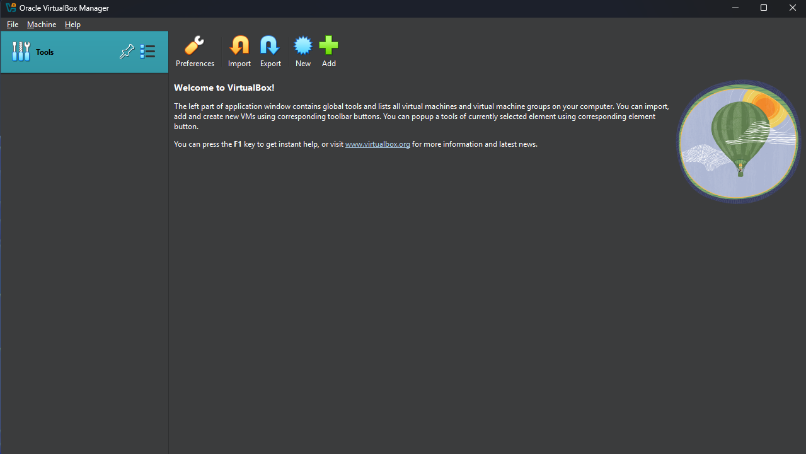

# Here Is A View Into my Self-Hosted _SIEM_ Lab
I made three different machines. The first being a windows victim using windows 11, to simulate a employee of a organization. The second is a Ubuntu Linux server hosting the Splunk SIEM. The third is my attacker running KALI Purple distro. I choose KALI Purple because it offeres opportunities, to attack and analyze the attacks. 

